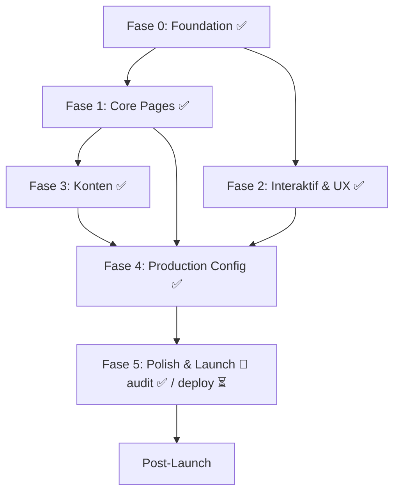

# Cup of Code — Roadmap Pengembangan

> **Status Dokumen:** Aktif
> **Update Terakhir:** 2026-07-30
> **Target MVP Launch:** Q3 2026

> 🎯 **Scope Produk (diredefinisi 2026-07-30):** Cup of Code adalah **content-driven blog/kreator** — fokus pada **artikel & tutorial** (`/posts`), **aset digital** (UI component/template, **AI prompt**, custom gem — `/assets`), dan **code snippet** (`/snippets`). **Bukan LMS / aplikasi belajar.** Akibatnya Fase 6 (Learning Pathways & Roadmap Interaktif) **dihapus**. Sumber kebenaran eksekusi: `docs/PRE-PRODUCTION-SPRINTS.md`.

---

## Daftar Isi

- [Fase 0 — Foundation (Selesai)](#fase-0--foundation-selesai)
- [Fase 1 — Core Pages & Dynamic Content (Selesai)](#fase-1--core-pages--dynamic-content-selesai)
- [Fase 2 — Fitur Interaktif & UX (Selesai)](#fase-2--fitur-interaktif--ux-selesai)
- [Fase 3 — Konten & Pembersihan (Selesai)](#fase-3--konten--pembersihan-selesai)
- [Fase 4 — Production Configuration](#fase-4--production-configuration)
- [Fase 5 — Polish & Launch](#fase-5--polish--launch)
- [Post-Launch — Iterasi & Scale](#post-launch--iterasi--scale)
- [Appendix](#appendix)

---

## Fase 0 — Foundation (Selesai)

Status: **100%** — Infrastructure dan design system inti sudah terpasang.

### Checklist

| Item | Status | Keterangan |
|------|--------|------------|
| Astro 7 + React 19 + Tailwind CSS 4 | ✅ | Framework stack terkonfigurasi penuh |
| TypeScript 6 (strict mode) | ✅ | `tsconfig.json` dengan strictNullChecks |
| Build pipeline (`astro build`) | ✅ | Output `dist/` ter-generate |
| Node standalone adapter | ✅ | Siap deploy di Node server |
| Sitemap auto-generation | ✅ | `@astrojs/sitemap` terintegrasi |
| Design tokens (CSS variables) | ✅ | Warna, tipografi, spacing, shadow di `global.css` |
| Font: Cal Sans + Inter | ✅ | Google Fonts terhubung (body: Inter sejak Sprint 3; display: Cal Sans) |
| Tag tone system (yellow/green/pink) | ✅ | Tiga varian warna untuk kategori |
| Header + Footer + BaseHead | ✅ | Komponen layout global |
| Keystatic CMS — 4 collections | ✅ | posts, categories, snippets, digitalAssets |
| Zod schema validation | ✅ | Semua koleksi punya validasi |
| Open Graph / Twitter meta tags | ✅ | BaseHead sudah include OG + Twitter card |
| Canonical URL | ✅ | Per URL sudah ada canonical link tag |
| Homepage hero + featured article | ✅ | Layout hero, avatar, CTA |
| About page | ✅ | Halaman tentang dengan deskripsi |
| Post detail page (TOC, share, related) | ✅ | Halaman artikel lengkap dengan Daftar Isi interaktif |
| Content: 2 posts + 3 categories | ✅ | Konten real untuk posts |
| Content: 3 digital asset stubs | ✅ | Minimal frontmatter |
| Content: 2 snippet stubs | ✅ | Placeholder |

---

## Fase 1 — Core Pages & Dynamic Content (Selesai)

**Target:** Semua halaman utama memiliki route, konten dinamis dari collection, dan tidak ada stub kosong.  
**Estimasi:** 5-7 hari  

| # | Task | Detail | Referensi | Prioritas |
|---|------|--------|-----------|-----------|
| 1.1 | **Digital Assets — Listing Page** | Implementasi `src/pages/assets/index.astro`: grid cards, filter by type (component/prompt/gem), search, kategori, pagination | `docs/references/assets.html` | 🔴 Critical |
| 1.2 | **Digital Assets — Detail Page** | Implementasi `src/pages/assets/[...slug].astro`: render konten berdasarkan `type` — `component` tampilkan live preview, `prompt` tampilkan PromptFiller, `gem` tampilkan GemsViewer | `docs/references/asset-details.html`, `ui-components.html`, `prompts.html`, `gems.html` | 🔴 Critical |
| 1.3 | **ComponentPreview.astro** | Isi komponen: render preview + code block + format/badge info | — | 🔴 Critical |
| 1.4 | **GemsViewer.astro** | Isi komponen: display instruksi gem, tombol copy, variabel editor | — | 🔴 Critical |
| 1.5 | **PromptFiller.astro** | Isi komponen: form interaktif dengan input variabel, preview prompt hasil isian, tombol copy | — | 🔴 Critical |
| 1.6 | **Snippets — Listing Page** | Buat `src/pages/snippets/index.astro`: grid cards + filter bahasa, search | `docs/references/snippet-library.html` | 🟠 High |
| 1.7 | **Snippets — Detail Page** | Buat `src/pages/snippets/[...slug].astro`: syntax highlighting, copy button, language badge | `docs/references/snippet-library.html` | 🟠 High |
| 1.8 | **404 Page** | Buat `src/pages/404.astro`: custom 404 dengan navigasi dan search | `docs/references/404.html` | 🟠 High |
| 1.9 | **Refactor Homepage — Dynamic Content** | Ganti hardcoded `articles[]` dengan `getCollection("posts")`, gunakan `featured` field untuk featured article | — | 🔴 Critical |
| 1.10 | **Refactor Homepage — Dynamic Categories** | Sidebar kategori harus filter posts secara real | — | 🔴 Critical |
| 1.11 | **Refactor Homepage — Dynamic Pagination** | Implement pagination dari collection, bukan hardcoded 1-5 | — | 🟠 High |
| 1.12 | **Blog Posts Listing — Redesign** | Upgrade `posts/index.astro`: grid cards, category filter via query param `?cat=`, search | `docs/references/category.html` | 🟠 High |
| 1.13 | **Contact Page** | Buat `src/pages/contact.astro`: form kontak, info, social links | `docs/references/contact.html` | 🟡 Medium |
| 1.14 | **Layout System** | Buat BaseLayout di `src/layouts/`: wrap header + footer + main untuk reuse | — | 🟡 Medium |
| 1.15 | **Keystatic — Snippets + Assets Routes** | Pastikan Keystatic dashboard bisa manage snippets dan digital assets | — | 🟠 High |

**Deliverables Fase 1:**
- ✅ Semua halaman utama punya route dan menampilkan konten dari CMS
- ✅ Tidak ada file `.astro` yang hanya berisi `---`
- ✅ Homepage mereflect data real dari content collections
- ✅ Digital assets & snippets bisa diakses via URL

---

## Fase 2 — Fitur Interaktif & UX (Selesai)

Status: **100%** — Semua elemen interaktif dan navigasi responsif terimplementasi.

| # | Task | Status | Keterangan |
|---|------|--------|------------|
| 2.1 | Search Functionality | ✅ | SearchBar React component dengan keyboard nav + auto-close |
| 2.2 | Share Buttons — Real Links | ✅ | Diimplementasi di Fase 1 |
| 2.3 | Newsletter Form — Integration | ✅ | NewsletterForm React + `POST /api/newsletter` endpoint |
| 2.4 | Mobile Navigation | ✅ | MobileNav React component dengan hamburger menu |
| 2.5 | TOC Scroll Spy | ✅ | Diimplementasi di Fase 1 |
| 2.6 | Copy Code Button | ✅ | CopyButton React + sidebar copy di snippet detail |
| 2.7 | Skeleton Loading | ✅ | CSS skeleton classes + shimmer animation di global.css |
| 2.8 | Scroll Animations | ✅ | ScrollAnimations Astro component dengan IntersectionObserver |
| 2.9 | Back to Top Button | ✅ | BackToTop React component, muncul > 300px scroll |
| 2.10 | Image Lazy Loading | ✅ | Audit: eager untuk hero, lazy default untuk sisanya |
| 2.11 | Breadcrumb Navigation | ✅ | Breadcrumb Astro component di semua detail pages |

**Deliverables Fase 2:**
- ✅ Search berfungsi di semua halaman yang relevan (homepage, posts, assets, snippets)
- ✅ Share artikel bekerja ke platform sosial media (WhatsApp, Facebook, Twitter/X)
- ✅ Newsletter form mengirim data ke endpoint API
- ✅ Navigasi responsif — hamburger menu di mobile, full nav di desktop
- ✅ Scroll animations dengan fade-in effect
- ✅ Back to top button yang smooth
- ✅ Breadcrumb di semua halaman detail
- ✅ Skeleton loading + reduced motion support

---

## Fase 3 — Konten & Pembersihan (Selesai)

**Target:** Konten siap publikasi, tidak ada placeholder, visual konsisten.  
**Estimasi:** 5-8 hari | **Realiasi:** ~2 jam  

Status: **100%** — Semua konten terisi, fitur pembersihan terimplementasi.

| # | Task | Status | Keterangan |
|---|------|--------|------------|
| 3.1 | **Populate Snippets** | ✅ | `format-currency` (IDR formatter) & `use-debounce-hook` (generic React hook) dengan kode, docs, contoh |
| 3.2 | **Populate Digital Assets — UI Components** | ✅ | Bento Grid Card: kode komponen, props table, variasi layout 3/4 kolom, contoh penggunaan |
| 3.3 | **Populate Digital Assets — Prompts** | ✅ | DeepSeek Code Explainer: prompt template, variabel input, contoh output, tips penggunaan |
| 3.4 | **Populate Digital Assets — Gems** | ✅ | UX Writing Assistant: system instructions, cara setup, contoh transformasi teks, knowledge base |
| 3.5 | **Add Blog Posts (Min 5-7)** | ✅ | 3 artikel baru: Tailwind+Vite, Zustand, Node.js security — total 5 artikel |
| 3.6 | **Featured Image Strategy** | ✅ | Standarisasi dengan fallback; gambar real dari Unsplash ditampilkan di listing |
| 3.7 | **Author Bio** | ✅ | Section author di footer artikel dengan avatar, bio, social links |
| 3.8 | **Table of Contents — Auto-generate** | ✅ | TOC dari heading h2 dengan IntersectionObserver scroll spy (sudah berfungsi) |
| 3.9 | **Reading Time Estimator** | ✅ | Estimasi dari word count (200 kata/menit), ditampilkan di header artikel |
| 3.10 | **Related Posts — Smart Logic** | ✅ | Prioritas kategori sama, fallback ke post lain |
| 3.11 | **Image Alt Text Audit** | ✅ | Semua gambar real punya alt text; placeholder icon sudah sesuai |

**Deliverables Fase 3:**
- ✅ Semua konten terisi dan bukan placeholder
- ✅ Snippets bisa di-copy langsung dan dipakai
- ✅ Digital assets punya instruksi lengkap
- ✅ Minimum 5 artikel blog (total 5: 2 existing + 3 baru)

---

## Fase 4 — Production Configuration (Selesai)

**Target:** Siap dideploy ke production environment dengan infrastruktur yang aman.  
**Estimasi:** 3-5 hari | **Realiasi:** ~1 jam  
**Status:** **100%** — Semua konfigurasi production terimplementasi.

| # | Task | Status | Detail |
|---|------|--------|--------|
| 4.1 | **Keystatic — GitHub Storage** | ✅ | Dual-mode storage: local untuk dev, GitHub untuk production via `KEYSTATIC_STORAGE_KIND` env var |
| 4.2 | **Set Production Domain** | ✅ | `site` config menggunakan `PUBLIC_SITE_URL` env var dengan fallback `https://cupofcode.cc` |
| 4.3 | **Environment Variables** | ✅ | File `.env.example` dengan dokumentasi lengkap semua variabel |
| 4.4 | **RSS Feed** | ✅ | Endpoint `/rss.xml` via `@astrojs/rss` untuk blog posts |
| 4.5 | **Privacy Policy Page** | ✅ | Halaman `/privacy` sesuai standar GDPR/Indonesia |
| 4.6 | **Terms of Service Page** | ✅ | Halaman `/terms` untuk digital assets, snippets, dan konten |
| 4.7 | **Analytics Setup** | ✅ | Integrasi Plausible/Umami/Google Analytics via BaseHead + env var |
| 4.8 | **CI/CD Pipeline** | ✅ | GitHub Actions: lint → typecheck → build → SCP deploy ke VPS + PM2 restart |
| 4.9 | **Robots.txt** | ✅ | `public/robots.txt` dengan Allow all + Sitemap link |
| 4.10 | **Structured Data** | ✅ | JSON-LD Article + BreadcrumbList + WebSite + Organization (divalidasi Sprint 2/S5.3) |
| 4.11 | **Security Headers** | ✅ | Middleware: X-Content-Type-Options, X-Frame-Options, Referrer-Policy, Permissions-Policy + HSTS (Sprint 1) + CSP (Sprint 5) |
| 4.12 | **Error Monitoring** | ✅ | `@sentry/astro` plugin dengan env var `PUBLIC_SENTRY_DSN` |
| 4.13 | **Performance Budget** | ✅ | Dokumentasi threshold di `docs/PERFORMANCE-BUDGET.md` |
| 4.14 | **Backup Strategy** | ✅ | Dokumentasi strategi backup di `docs/BACKUP-STRATEGY.md` |

**Deliverables Fase 4:**
- ✅ Domain aktif dengan SSL (konfigurasi via env var)
- ✅ Keystatic bisa manage content di production (GitHub OAuth)
- ✅ Analytics terpasang (Plausible/Umami/GA)
- ✅ CI/CD otomatis untuk build & deploy ke VPS
- ✅ Halaman legal (privacy, terms) tersedia di `/privacy` dan `/terms`
- ✅ SEO structured data (JSON-LD Article) terimplementasi

---

## Fase 5 — Polish & Launch

**Target:** Pengalaman pengguna premium, siap go-live.  
**Estimasi:** 4-6 hari  

> ⚠️ **Rekonsiliasi (2026-07-30):** Item fitur (5.1–5.11) terimplementasi. Item audit/verifikasi (5.3 aksesibilitas, 5.4 SEO, 5.5 performance, 5.6 cross-browser, 5.12 pre-launch) **diverifikasi ulang** via **Pre-Production Sprints 1–5** (`docs/PRE-PRODUCTION-SPRINTS.md`) karena klaim ✅ sebelumnya belum teruji. Item 5.13 (Deploy Production) & 5.14 (Post-launch Monitoring) **belum** dieksekusi — menunggu go-live. Sumber kebenaran status kini `PRE-PRODUCTION-SPRINTS.md`.

| # | Task | Detail | Prioritas |
|---|------|--------|-----------|
| 5.1 | **Dark Mode** | Theme toggle dengan CSS variables + persist di localStorage | 🟠 High |
| 5.2 | **Page Transitions** | Astro View Transitions untuk navigasi mulus antar halaman | 🟠 High |
| 5.3 | **Accessibility Audit** | Lighthouse aksesibilitas 100%; ARIA labels, keyboard nav, contrast ratio WCAG AA | 🔴 Critical |
| 5.4 | **SEO Audit** | Validasi semua meta tags, canonical, sitemap, structured data dengan Google Rich Results Test | 🔴 Critical |
| 5.5 | **Performance Audit** | Lighthouse performance 90+; bundle analysis; Core Web Vitals | 🔴 Critical |
| 5.6 | **Cross-browser Testing** | Chrome, Firefox, Safari, Edge — termasuk mobile | 🟠 High |
| 5.7 | **Mobile Touch UX** | Touch targets min 44px, swipe gestures, bottom nav | 🟡 Medium |
| 5.8 | **Loading States** | Tambahkan loading spinner/skeleton untuk semua data fetching | 🟡 Medium |
| 5.9 | **Error States** | Empty state untuk search tanpa hasil, error state untuk network failure | 🟡 Medium |
| 5.10 | **PWA Support (Opsional)** | Manifest.json + service worker untuk offline support | 🟢 Low |
| 5.11 | **Social Preview Cards** | Generate Open Graph images otomatis per artikel | 🟡 Medium |
| 5.12 | **Pre-launch Checklist** | Final review: broken links, console errors, form validation, 404 testing | 🔴 Critical |
| 5.13 | **Deploy Production** | Deploy ke production server, verifikasi DNS, SSL, redirects | 🔴 Critical |
| 5.14 | **Post-launch Monitoring** | Cek analytics real-time, error rate, response time 24 jam pertama | 🟠 High |

**Deliverables Fase 5:**
- ✅ Lighthouse score 90+ (performance, accessibility, SEO)
- ✅ Dark mode tersedia
- ✅ Page transitions mulus
- ✅ Semua error/loading/empty states tertangani
- ✅ Pre-launch checklist terverifikasi
- ✅ Live di production domain

---

## Fase 6 — Learning & Roadmap Features ❌ DE-SCOPED (2026-07-30)

> ⚠️ **Fitur dihapus.** Learning Pathways (`/learning`) & Roadmap Interaktif (`/roadmap`) **dihapus sepenuhnya** karena arah produk diubah: Cup of Code adalah **content-driven blog** (artikel, tutorial, aset digital: template/snippet/AI prompt), **bukan LMS/aplikasi belajar**. Halaman, komponen `RoadmapStep`, navigasi (Header/Footer), dan precache SW dihapus. Catatan: artikel blog `posts/roadmap-jadi-web-developer-...` **tetap ada** (itu konten editorial, bukan fitur LMS).

**Riwayat (sebelum dihapus):**
- P.7 Learning Pathways (`/learning`) — pernah terimplementasi, kini dihapus
- P.8 Web Dev Roadmap Interaktif (`/roadmap`) + `RoadmapStep.tsx` — pernah terimplementasi, kini dihapus

---

## Post-Launch — Iterasi & Scale

**Target:** Fitur lanjutan untuk engagement, monetisasi, dan scale.  
**Estimasi:** Ongoing — roadmap 3-6 bulan ke depan  

| # | Feature | Detail | Timeline |
|---|---------|--------|----------|
| P.1 | **User Accounts** | Registrasi/login via Supabase/Auth.js untuk download aset | Bulan 1 |
| P.2 | **Digital Asset Download** | Track download count, user library, download history | Bulan 1 |
| P.3 | **Comment System** | Diskusi per artikel, reply, notifikasi | Bulan 1-2 |
| P.4 | **Paid Assets** | Premium assets dengan payment gateway (Midtrans/Xendit) | Bulan 2-3 |
| P.5 | **User Dashboard** | Riwayat download, saved posts, preferences | Bulan 2 |
| P.6 | **Content Rating** | Like/rating untuk artikel dan assets | Bulan 2 |
| P.7 | ~~**Learning Pathways**~~ | ❌ **DE-SCOPED** — dihapus 2026-07-30. Arah produk: content-driven blog, bukan LMS |
| P.8 | ~~**Web Dev Roadmap Interaktif**~~ | ❌ **DE-SCOPED** — dihapus 2026-07-30 (artikel blog terkait tetap ada sebagai konten editorial) |
| P.9 | **Admin Dashboard** | Analytics, user management, content moderation | Bulan 3-4 |
| P.10 | **Email Newsletter Engine** | Automated digest, trigger based on new content | Bulan 4 |
| P.11 | **Multi-language** | i18n — Inggris sebagai bahasa kedua | Bulan 4-5 |
| P.12 | **Community Forum** | Q&A, sharing snippets, mentoring | Bulan 5-6 |
| P.13 | **AI-powered Features** | Auto-tagging, content recommendations, smart search | Bulan 6+ |

---

## Timeline Visual

```
Bulan 1 (Selesai)
├── Fase 1: Core Pages & Dynamic Content     ████████████ 5-7 hari ✅
├── Fase 2: Fitur Interaktif & UX            ████████████ 4-6 hari ✅
└── Fase 3: Konten & Pembersihan              ████████████ 5-8 hari ✅

Bulan 2
├── Fase 4: Production Configuration          ████████████ 3-5 hari ✅
└── Fase 5: Polish & Launch                   ██████░░░░░░ 4-6 hari
    └── 🚀 LAUNCH!

Bulan 3
├── Fase 6: Learning & Roadmap Features       ❌ DE-SCOPED (dihapus)
└── (arah produk: content-driven blog, bukan LMS)

Bulan 3-6
└── Post-Launch: Iterasi & Scale              ██░░░░░░░░░░ Ongoing
```

---

## Dependencies Map



> **Catatan:** Fase 3 (Konten) bisa dikerjakan paralel dengan Fase 1 dan 2 jika ada content writer terpisah dari developer. Jika satu orang merangkap kedua peran, kerjakan sekuensial.

---

## Teknikal Notes & Keputusan Arsitektur

### Routing Strategy
- `/` — Homepage
- `/about` — Tentang
- `/contact` — Kontak
- `/posts` — Blog listing
- `/posts/[...slug]` — Blog detail
- `/assets` — Digital assets listing
- `/assets/[...slug]` — Digital asset detail (render UI sesuai `type`)
- `/snippets` — Snippet library listing
- `/snippets/[...slug]` — Snippet detail
- `/keystatic` — CMS dashboard

### Component Tree (Target)
```
Layouts/
├── BaseLayout.astro      # Header + Footer + main slot

Components/
├── Header.astro          # Nav + mobile menu
├── HeaderLink.astro      # Active state link
├── Footer.astro          # Footer + newsletter
├── BaseHead.astro        # SEO meta tags
├── Card.astro            # Reusable card component
├── Pagination.astro      # Dynamic pagination
├── SearchBar.astro       # Search input + results
├── ShareButtons.astro    # Social share
├── Breadcrumb.astro      # Breadcrumb nav
├── digital-assets/
│   ├── ComponentPreview.astro  # Live UI preview
│   ├── GemsViewer.astro        # Gem instruction viewer
│   └── PromptFiller.astro       # Interactive prompt form
└── snippets/
    └── CodeBlock.astro   # Syntax highlighting + copy
```

### Data Flow
```
Keystatic CMS (local/GitHub)
    │
    ▼
src/content/ (file-based collections)
    │
    ▼
Astro Content Collections API (getCollection / getEntry)
    │
    ▼
Pages (static generation / SSR)
    │
    ▼
Components (render UI)
```

### Content Schema Reference

Semua schema ada di `src/content.config.ts`. Jika ada perubahan, sync juga ke `keystatic.config.ts`.

| Collection | Fields | Entries | Status |
|-----------|--------|---------|--------|
| posts | title, category, description, publishDate, featured, featured_image, content (markdoc) | 5 | ✅ Stable |
| categories | name, label, tone (yellow/green/pink) | 3 | ✅ Stable |
| snippets | title, description, language (ts/js/css/html), content (markdoc) | 2 | ✅ Stable |
| digitalAssets | title, description, type (component/prompt/gem), isFree, format, fileSize, variables[], content (markdoc) | 3 | ✅ Stable |

### Teknologi Stack

| Layer | Tech | Catatan |
|-------|------|---------|
| Framework | Astro 7 | App Router, View Transitions |
| UI Library | React 19 | Untuk komponen interaktif |
| Styling | Tailwind CSS 4 | Vite plugin, CSS-first config |
| CMS | Keystatic | Local dev → GitHub storage di production |
| Content | Markdoc | Rich text + custom tags |
| Icons | Lucide (astro + react) + inline SVG | Lucide untuk UI; brand/share via inline SVG. FontAwesome dihapus di Sprint 4 |
| Fonts | Cal Sans + Inter | Display: Cal Sans; body: Inter (ganti Google Sans Flex sejak Sprint 3) |
| Deployment | Node standalone | Vercel / Railway / VPS |
| Analytics | TBD | Plausible/Umami recommended |

---

## Risk Register

| Risk | Dampak | Mitigasi |
|------|--------|----------|
| Keystatic API changes | CMS tidak bekerja | Pin version di package.json, monitor changelog |
| Tailwind CSS 4 regresi | Styling broken | Lock version, testing visual |
| Astro 7 beta/rc bugs | Build failure | Gunakan stable version, test build tiap fase |
| Akses font terbatas | UI broken | Fallback system fonts di CSS |
| Konten tidak cukup saat launch | Engagement rendah | Prepare 5+ artikel sebelum launch |
| Performance issue mobile | User experience buruk | Audit tiap fase, optimasi gambar |

---

## Metrik Keberhasilan Launch

| Metrik | Target MVP | Target 3 Bulan |
|--------|-----------|----------------|
| Lighthouse Performance | 90+ | 95+ |
| Lighthouse Accessibility | 95+ | 100 |
| Lighthouse SEO | 95+ | 100 |
| Page Load Time (mobile) | < 3s | < 2s |
| Core Web Vitals (LCP) | < 2.5s | < 1.8s |
| Blog Posts | 5+ | 20+ |
| Snippets | 5+ | 15+ |
| Digital Assets | 5+ | 20+ |
| Uptime | 99.5% | 99.9% |
| First Byte (TTFB) | < 800ms | < 400ms |

---

## Cara Menggunakan Dokumen Ini

1. **Developer:** Checklist task per fase. Update status setelah selesai.
2. **Content Writer:** Fokus di Fase 3 — populate konten real.
3. **Project Manager:** Track progress per fase, sesuaikan estimasi.
4. **Stakeholder:** Lihat timeline dan metrik untuk decision making.

> **Prinsip:** Setiap fase harus menghasilkan **halaman yang bisa diakses via URL** dan **tidak ada fitur broken**. Prioritaskan deliverable over perfection.

---

*Dokumen ini direview dan diupdate setiap akhir fase.*
